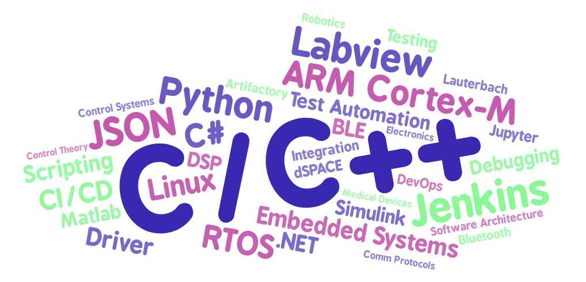

# Alexandre Perrin

**Embedded Software and Real Time Systems Engineer**

## Experience 

**Control Systems and Embedded Software Expert**
*[Merck Millipore](http://www.merckmillipore.com) - 2018*

I worked on new commercial Milli-Q products (IQ-7000v2, IQ-70XX, EQ-7000, IX-7000)
* wrote functional and design specifications
* contributed to baremetal and linux based firmware development and maintenance
* contributed to CI/CD platform improvement (Jenkins, Artifactory, Conan)

**Embedded Software Engineer**
*[Merck Millipore](http://www.merckmillipore.com) - 2013 - 2018*

**Embedded Software Engineer**
*[Médiane Systèmes](https://www.medianesysteme.com/) - 2010 -2013*

**Software Developper**
*[Hauptman Woodward Institute](https://hwi.buffalo.edu/) - 2009 - 2010*

**Software Developper Intern**
*[Hauptman Woodward Institute](https://hwi.buffalo.edu/) - 2009*

